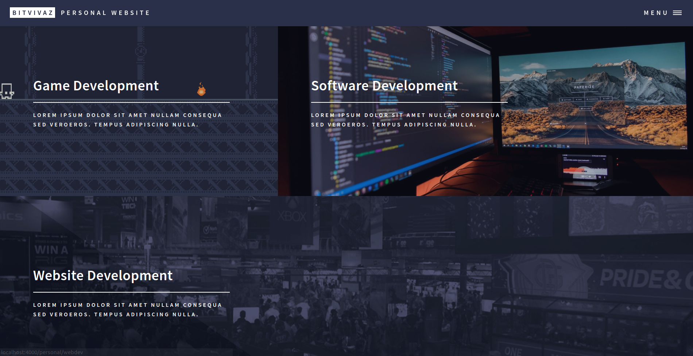

### Personal Website

I have always Wanted a website where I could display all my projects I've made. After learning about GitPages, I decided on trying out Jekyll. After searching through a lot of Jekyll themes I came by the Forty Jykell Theme which I just loved! I decided to edit it to my needs and from there it's been turning into slowly into the website I wanted.

<b>Website:</b> [BitVivAZ](https://bitvivaz.com)

### Tech Stack

- Jekyll
- Forty Jekyll Theme
- HTML
- CSS
- JavaScript
- Markdown
- GitPages

### Screenshot

